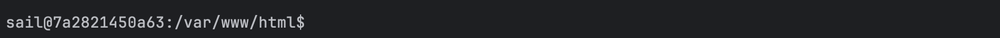
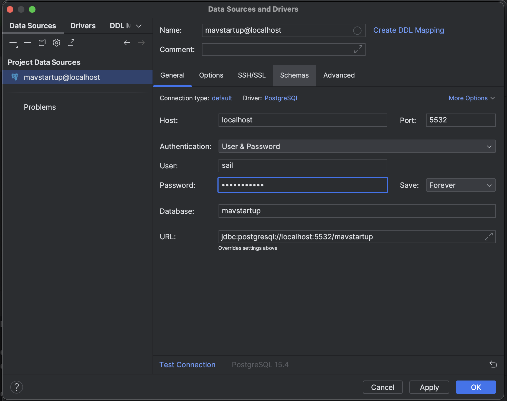

## Environment Setup for Mavstartup Project

**A. For MACOS env:**

1. **Install necessary packages for installation**

- If you have not installed brew yet, please visit [https://brew.sh/](https://brew.sh/) to install Homebrew. This is an important step for Mac users to install php and composer for Laravel Sail installation.
- Paste this into your Terminal to install Homebrew:
    - /bin/bash -c "$(curl -fsSL [https://raw.githubusercontent.com/Homebrew/install/HEAD/install.sh](https://raw.githubusercontent.com/Homebrew/install/HEAD/install.sh))"
- Then, install php and composer by using brew
    - Commands:
        - brew install php
        - brew install composer

2. **Clone from remote repository**

- Then, go to "mavstartup" remote repository on github, and copy url for SSH for git clone to your local machine:

- After that, use git clone \<url\> like below in your terminal:

- Then, change your directory to mavstartup by using
    - 'cd mavstartup'
- By now, you should be using PhpStorm for the code editor provided by JetBrains for your project.

3. **Laravel Sail installation for the project**

- First, install Docker Desktop by visiting: [https://www.docker.com/products/docker-desktop/](https://www.docker.com/products/docker-desktop/)
    - Choose the link with your machine's chip (Intel/Apple Chip)
- Make sure to move your app to Applications folder after the download.
- Open Docker Desktop application.
- Then, go to the Terminal with your mavstartup directory, then use the command to copy content from .env.example to a newly created .env file:
    - cp .env.example .env
- Next, visit Laravel Sail documentation for proper installation.
    - Link: [https://laravel.com/docs/10.x/sail#installing-sail-into-existing-applications](https://laravel.com/docs/10.x/sail#installing-sail-into-existing-applications)
    - Make sure to follow the steps from the link with the commands below:
        - Install composer dependencies: 'composer require laravel/sail –dev'
        - 'php artisan sail:install', and make sure to select 'pgsql' by pressing Spacebar and de-select 'mysql'
        - Start Sail: "./vendor/bin/sail up", or "sail up" after you have configured shell alias by pasting this command to your Terminal:
            - alias sail='[-f sail] && sh sail || sh vendor/bin/sail'
        - After your Sail is up and running, make sure that your containers are running:

- Next, go to your PhpStorm application with mavstartup project, and open .env file to check if you have proper configuration like below:

- If it is correct, open a new Terminal window, and use command to open container shell:
    - ./vendor/bin/sail shell, or
    - 'sail shell' if you have already done alias step. The terminal should be like this after you opened the shell:

- Now, you are ready to migrate by using 'php artisan migrate'.
- After successful migration, you should go to PhpStorm to setup to view your actual database. Navigate to the database icon on the top-right corner: 
- Choose '+' sign, hover Data Source, and find PostgreSQL.
- Configure fields like below, password should be the same DB\_PASSWORD inside your .env file.
    - Note: If you face Warning like Missing Driver Files, you should click on Download.

- Hit Test Connection
- If successful, hit Apply -\> OK.
- Now you can view your database:

